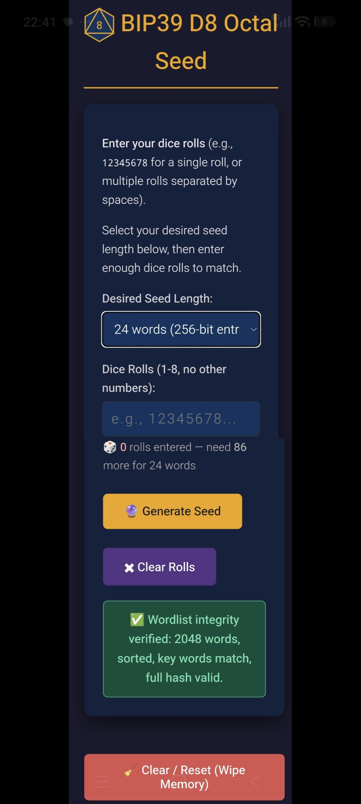
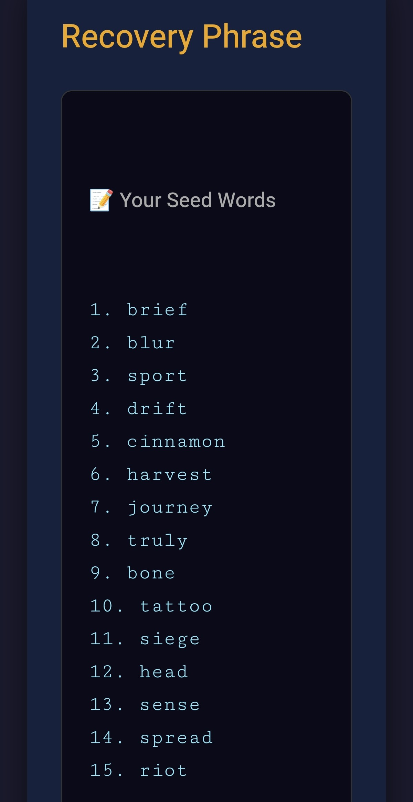
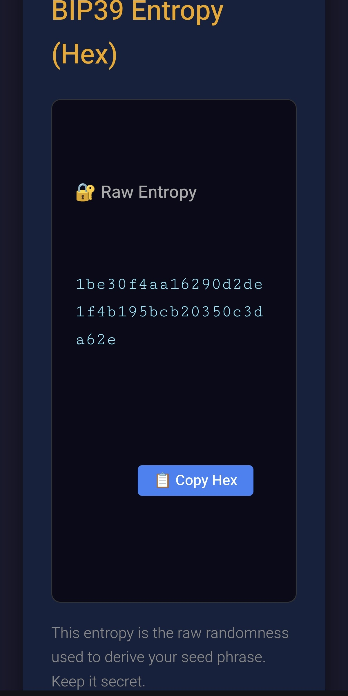
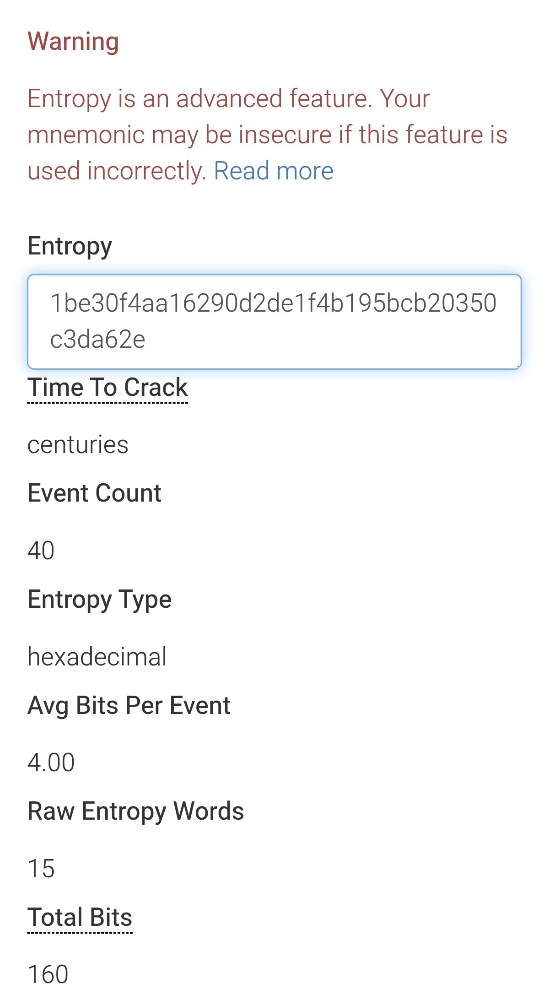

# BIP39 D8 Octal Seed Generator

Generate Bitcoin BIP39 mnemonic seed phrases from 8-sided dice rolls — offline, air-gapped, and zero modulo bias.
A single, self-contained HTML file that converts d8 dice rolls into BIP39 mnemonics using **direct octal→binary entropy conversion**. Zero dependencies, zero network calls, works entirely in your browser.

---

## 🚀 Quick Start

1. Download `index.html` from this repository.
2. Disconnect from the internet.
3. Open the file in your browser.
4. Select your desired seed length (12, 15, 18, 21, or 24 words).
5. Roll your d8 and enter the results — once the exact roll threshold is reached (e.g., 43 rolls for 12 words), further inputs automatically lock to preserve exact entropy parameters.
6. Click **Generate Mnemonic**.

---

## 📸 Screenshots

### 1. Input Dashboard – Enter your d8 rolls

*Select your seed length, type d8 rolls (space-separated), and watch the live counter turn green when enough rolls are entered.*

### 2. Generated Seed Words

*Your BIP39 mnemonic appears in a clean, numbered list for safe, easy transcription.*

### 3. Raw Entropy (Hex)

*The pre-checksum raw entropy is displayed in hexadecimal format for cross-verification with external tools.*

### 4. Cross-Verification with Ian Coleman

*Paste the raw entropy into [Ian Coleman's BIP39 tool](https://iancoleman.io/bip39/) to confirm the derived mnemonic matches exactly. The stats panel confirms the entropy strength (e.g., 256 bits, centuries to crack) – your dice rolls, your entropy, your keys, verified.*

---

## ✨ Features

* **Single HTML file** – no build step, no dependencies, no external scripts.
* **Zero modulo bias** – because 8 = 2³, each d8 roll maps exactly to 3 bits. No remainder, no rejection sampling, no safety-buffer inflation.
* **Direct octal→binary conversion** – dice rolls treated as octal digits (1→0, 2→1, …, 8→7), concatenated and converted straight to binary.
* **Fewer rolls required** – 43 rolls for 12 words, 86 for 24 words (vs. 54 and 104 for d6).
* **Strict Input Locking** – UI automatically caps text inputs and truncates paste operations once the exact target roll count is met.
* **Multiple seed lengths** – 12 (43 rolls), 15 (54 rolls), 18 (64 rolls), 21 (75 rolls), or 24 words (86 rolls).
* **Verified against Ian Coleman** – pasting generated raw entropy hex produces identical seed words, account keys, and addresses.
* **Live roll counter** – real-time progress display with dynamic UI feedback upon reaching target thresholds.
* **Wordlist integrity self-test** – cryptographically verifies the embedded BIP39 English wordlist (2048 words) via SHA-256 on every load.
* **Copy-to-clipboard** – for both the mnemonic and raw entropy hex.
* **Hard reset button** – wipes DOM state and nullifies closure-scoped JavaScript variables.
* **Dark mode UI** – clean contrast designed for long dice-rolling sessions.

---

## ⚙️ How It Works

1. **Dice rolls → octal digits → binary**
   Each roll (1-8) is mapped to an octal digit (0-7). The full sequence is concatenated and parsed as a base-8 integer, then expanded to binary (3 bits per digit).

2. **Trim to exact entropy size**
   The raw bitstream is truncated by discarding 1–2 excess most-significant bits to match the required entropy length:
   * **12 words** → 128 bits (16 bytes, 43 rolls, trim 1 bit)
   * **15 words** → 160 bits (20 bytes, 54 rolls, trim 2 bits)
   * **18 words** → 192 bits (24 bytes, 64 rolls, **zero trim**)
   * **21 words** → 224 bits (28 bytes, 75 rolls, trim 1 bit)
   * **24 words** → 256 bits (32 bytes, 86 rolls, trim 2 bits)

> **Note on Bit Surplus:** Because a d8 yields exactly 3 bits per roll, the total raw bits occasionally exceed the exact target (e.g., 43 rolls = 129 bits for a 12-word seed). The tool handles this by keeping the least-significant (rightmost) bits and discarding the excess most-significant (leftmost) bits. Because 8⁴³ (2¹²⁹) is an exact multiple of 2¹²⁸, this mathematical trimming is perfectly uniform and introduces **zero modulo bias**.

3. **Append BIP39 checksum**
   SHA-256 of the entropy — first N bits become the checksum.

4. **Map to words**
   Entropy + checksum split into 11-bit chunks, each indexing into the BIP39 English wordlist (2048 words).

---

## 🔧 Technical Details

| Parameter | Value |
|--------------------|-------------------------------------------------------------|
| Wordlist | BIP39 English (2048 words, sorted, verified) |
| Dice mapping | 1→0, 2→1, 3→2, 4→3, 5→4, 6→5, 7→6, 8→7 |
| Entropy source | Octal integer from dice rolls → binary |
| Checksum | SHA-256 (Web Crypto API + pure-JS fallback) |
| Min rolls (12 wds) | 43 |
| Min rolls (24 wds) | 86 |
| Bits per roll | **exactly 3.000** |
| Modulo bias | **Zero** (8ᴺ = 2³ᴺ, always a power of 2) |

---

## 🔒 Security

Use this tool on an **air-gapped** device only.

- Save the HTML file, disconnect from the internet, then open it.
- **Never** type real dice rolls into a network-connected device.
- Verify your dice are fair, balanced, and physically randomised.
- The file contains **no external scripts, no analytics, and no network calls**.
- All computation happens locally in your browser via the Web Crypto API with a **pure-JS SHA-256 fallback** for non-secure contexts (`file://`, HTTP).

---

## ⚠️ Verification & Compatibility

**How to verify your seed is correct:**

1. Generate your mnemonic and copy the **raw entropy hex** (displayed below the seed words).
2. Paste the hex into [Ian Coleman's BIP39 tool](https://iancoleman.io/bip39/).
3. Confirm the **mnemonic words match exactly**.

**Important note on dice-roll compatibility:**

This tool treats the first recorded die roll as the most significant octal digit. The full roll sequence is interpreted as a single octal integer, then converted to a big-endian hex string padded to the required byte length.
- ✅ Your **seed phrase** and **entropy hex** are always correct and verifiable.
- ✅ Pasting the entropy hex into Ian Coleman's tool will reproduce your seed words.
- ⚠️ Different tools may convert dice rolls to entropy using different methods. Always verify by comparing the **entropy hex** and resulting mnemonic, not by re-entering dice rolls into other tools.

**The core security principle:** Your seed phrase is valid and independently verifiable from the displayed entropy hex. Different dice-conversion conventions may produce different entropy from the same rolls, so always verify the entropy hex and resulting mnemonic rather than re-entering the rolls into another tool.

---
## Changelog
See [CHANGELOG.md](CHANGELOG.md).

## 🙏 Acknowledgements

- [Ian Coleman](https://iancoleman.io/bip39/) for the canonical BIP39 reference implementation
- [BIP39](https://github.com/bitcoin/bips/blob/master/bip-0039.mediawiki) – Bitcoin Improvement Proposal 39
- [bip-39-dice](https://github.com/IanMcLo/bip-39-dice) – sister project using standard 6-sided dice with base-6 conversion

---

## 📄 License

MIT – use at your own risk. This is security-critical software.
Review the code, verify the outputs against known test vectors, and **only use on air-gapped devices**.
